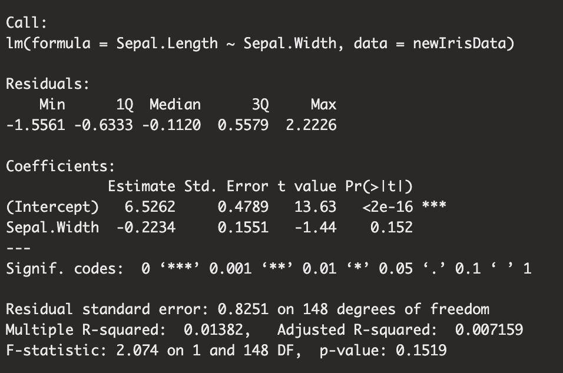
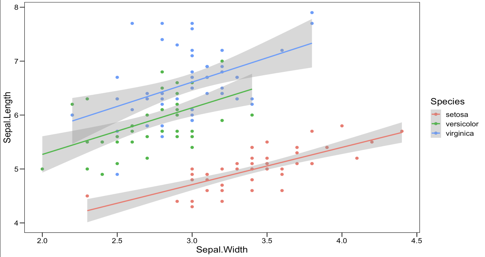

On this post I want to show how I would go about in sharing data analyses from RStudio. Since this website used markdown rather than R markdown, I made an R markdown file then copied and pasted the code to this markdown file. The images are screenshots of the intended outputs from this analysis. The code below shows a simple linear regression model and plot for the Sepal widths and Sepal Heights in the built in data set iris. This is just an example of how I would show data analysis on my website and as such the comparison of sepal width and height do not mean anything.


```{r}
library(tidyverse)
library(ggthemes)
irisData <- iris
newIrisData <- irisData %>%
  summarise(Sepal.Length, Sepal.Width, Species)

linearModel <- lm(Sepal.Length ~ Sepal.Width,data = newIrisData)
summary(linearModel)

p <- ggplot(data = newIrisData, aes(x = Sepal.Width, y = Sepal.Length, color = Species)) + 
  geom_point(size = 2) + 
  stat_smooth(method = "lm")
p + theme_base()
```

Here is the outcome of the linear model:



And Here is the outcome of the graph:


